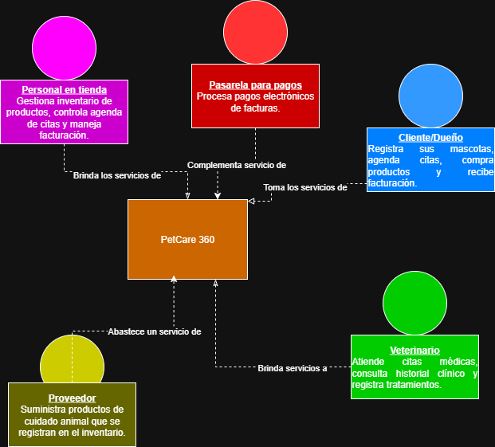
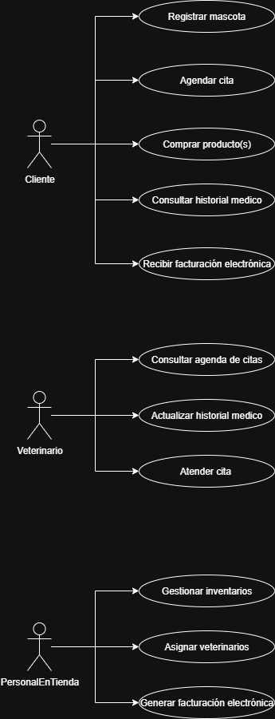
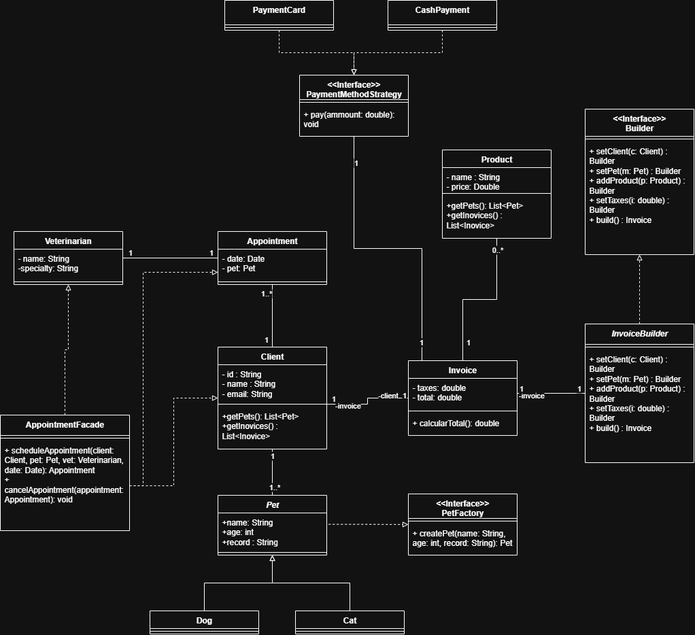

# PetCare 360 (Semana 1)

## Descripción
PetCare 360: plataforma para gestión de veterinarias.

## Tecnologías usadas
- Java 17
- Spring Boot
- Spring Data JPA
- Lombok
- Springdoc OpenAPI (Swagger UI)
- JUnit 5
- JaCoCo
- SonarQube

## Estrategia de versionamiento de ramas:

Las ramas que se manejaran seran:
- main.
- develop:
 - - feature/PlanRefuerzoAzul_DavidPalacios_FinalidadDeLaRama.

Al completarse el desarrollo de una rama feature, se realizará un merge a la rama develop, donde
de igual manera, al finalizar todo, se realizará merge sobre la rama main.

Los commits seguirán la estructura: "PetCare 360: NombreResponsable - Acción realizada."
## Diseño(Diagramación) 

### Diagrama de contexto:

### Diagrama casos de uso:

### Diagrama de clases:

## Patrones de diseño
### Creacionales:

- *Builder*: Ya que este patrón nos permite construir objetos complejos paso a paso, podemos usarlos para la construcción de las facturas electrónicas 
que contienen varios componentes(cliente, mascota, servicios, productos, impuestos). Lo que nos evita
constructores enormes y da flexibilidad en cómo se arman las facturas.

- *Factory Method*: Dado que con este patrón podemos crear objetos en una super clase desde una interfaz, mientras las 
subclases "alteran" este tipo de objetos, podemos usarlo para la creación de mascotas según el tipo (perro, gato, ave, etc.).
Permitiendo así, instanciar dinámicamente diferentes subclases de Mascota sin acoplarse a clases concretas.

### Estructurales:

- *Facade*: Teniendo en cuenta que este patrón busca proporcionar una interfaz simple a un subsistema complejo que contiene muchas partes móviles,
podemos usarlo en la gestión de citas médicas (revisar disponibilidad, asignar veterinario, notificar cliente), unificando múltiples subsistemas
en una interfaz simple para las veterinarias.

### Comportamiento:

- *Strategy*: Ya que este patrón nos dice que podemos separar los algoritmos que hacen cosas parecidas en clases concretas,
podemos utilizar este patrón para tener varios métodos de pago, encapsulandolos, y el sistema elige la estrategia adecuada.

## Patrones SOLID:
- S (Single Responsibility): Cada clase tiene una única responsabilidad, apoyados en una estructura que nos permita que: las entidades modelan datos, services aplican reglas, repositorios acceden a DB, controllers exponen endpoints.

- O (Open/Closed): Mediante el uso de interfaces (por ejemplo con los patrones Strategy y Factory) permite extender sin modificar código existente.

- L (Liskov Substitution): 

- I (Interface Segregation): Se cumplirá al no exponer una única interfaz con muchos métodos, sino al usar interfaces pequeñas, como en el proceso de facturación y generación de facturas.

- D (Dependency Inversion): Los services dependen de abstracciones (interfaces) y no de implementaciones concretas (inyección de dependencias con Spring).